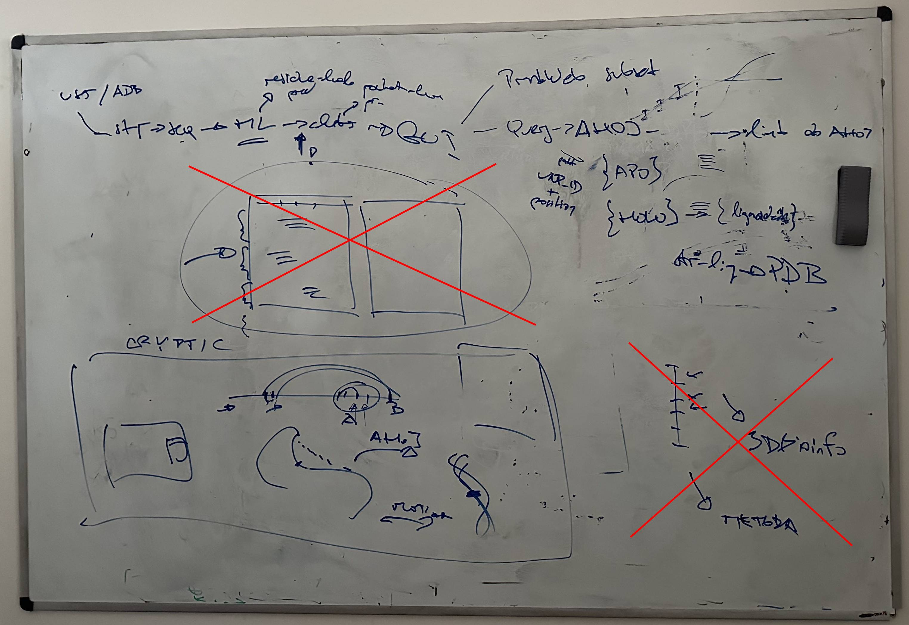
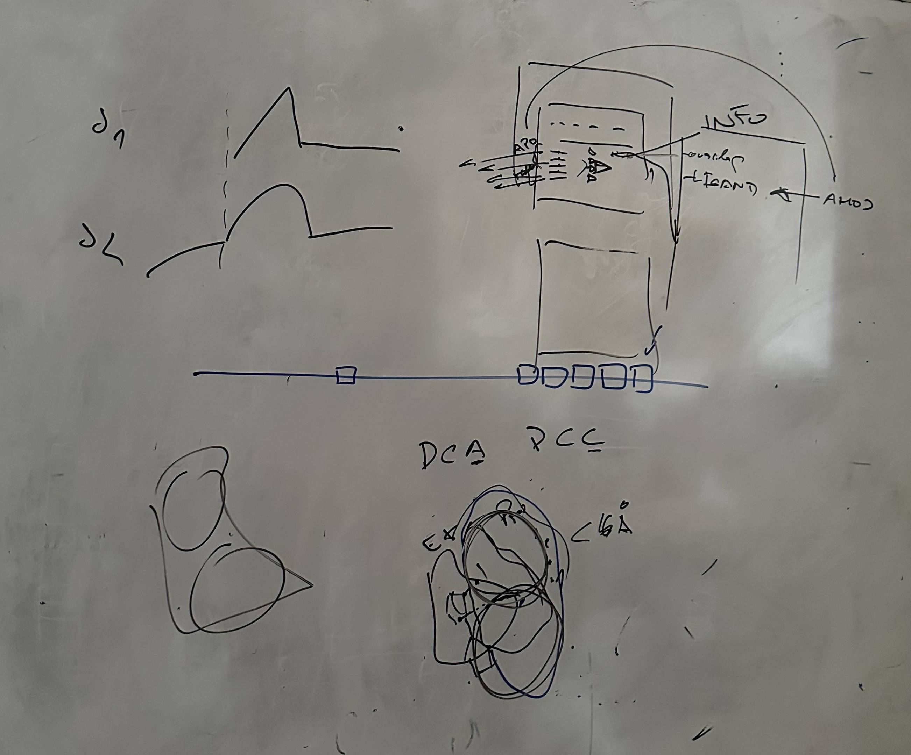

# thesis working notes, TODOs

## 28.1.2025 (meeting)

- prvni meeting
- stanoveni tematu - predikce cryptic binding sites, CryptoBench paper, AHoJ-DB a AHoJ -> vizualizace a webovy tool
- detekce pocketu ze 2 rezidui - clustering (ze dvou rezidui chceme urcovat cele pockety, ktere se k danemu binding spotu vazou)
- ukazat AHoJ-DB prekryv vice struktur?? 
- ukazat animaci mezi jednotlivymi stavy - treba v Mol*
- MDpocket - related paper

- otazky
  - jak to je s uniprot accession, je k jednomu proste vic PDB struktur? cim je to identifikovano, sekvenci??
  - co je lepsi, mensi resolution struktury?

## 4.2.2025 (meeting)

- recap
- workflow
  - zaciname se strukturou, muze byt z AFDB nebo RCSB PDB, pripadne i custom -> sequence -> (spolecne se strukturou) jdou do ML modelu, 
  ktery vyhodi residue-level predikce -> clustering, chceme z toho dostat pockety (resp. pocket-level predikce) -> GUI
  - GUI
    - "PrankWeb" cast - zobrazit pockety nejak obarvene, pripadne residue-level predikci a nejake informace o tom
    - query do AHoJ (pripadne PDB-KB), kde chceme dostat apo/holo (hlavne ty holo a jejich ligandy) struktury a pripadne jejich superpozice
    - superpozice pote chceme nejak vizualizovat, nejlepe aby to bylo videt pres sebe v Mol*
    - bylo by fajn tam mit moznost nejak vizualizovat motion ze snapshotu v PDB (napriklad pres dopocitani pres nejakou interpolaci)
    - pote take moznost z vysledku se dotazat do PDB
- next steps
  - pripravit architekturu tak, aby bylo mozne "neco poustet"
  - zkusit si rozbehnout nejaky model, viz zpravy s Vitou

## 16.2.2025

- prvni sketch architektury
  - budeme chtit 4 services
  - frontend: React - chceme proste neco, co se pouziva
  - backend pro server a postprocessing: FastAPI - chceme neco nejlepe v Pythonu, ale je to celkem jedno, spis pro konzistenci
  - backend pro ML: FastAPI - chceme neco, co se da pustit na GPU i CPU, proto to je separatni service, pozadavek Python kvuli ML
  - NginX: reverse proxy - chceme pod 1 domenou mit vsechny porty namapovane spravne
  - flow
    - User uploads a file from the frontend -> File is sent to backend 
    - Backend stores the file and forwards it to the ML machine -> Uses an HTTP request to ML Server (http://ml-server:9000/process)
    - ML Machine processes the file and returns results -> Runs ML inference, stores results, and sends back a response
    - Backend post-processes results and sends updates to frontend -> Uses WebSockets for real-time updates
    - Frontend receives and displays the final results
  - cele to bude zabalene do Docker Compose

## 23.2.2025

- mam prvni navrzenou architekturu
  - frontend: NginX, ktery dokaze servnout static files a je tam React
  - backend: FastAPI pro pousteni predikci
  - worker: Celery, CUDA support
  - redis: pro komunikaci FastAPI a Celery
  - chceme checkovat postupne task-status, asi se vykaslat na WebSockets a radsi to udelat pres polling? idk
  - 32 GB RAM requirement...
- TODO:
  - zacit pracovat na frontendu
  - poresit GPU, kde se to da poustet
  - zacit se ptat na ten clustering
  - podivat se na custom Celery status... https://celery.school/custom-celery-task-states
  - fix warningy z Celery apod.

## 27.2.2025 (meeting)

- Vita mi pretrenoval model na mensi, takze uz to rozjedu = pog
- TODOs:
  - zacit delat clustering, pripadne si promyslet, jak by se dalo na CryptoBench datasetu natrenovat neco pro ty pockety
  - podivat se na single-linkage clustering
  - insight: muze se hodit pocitat pairwise distances
  - po clusteringu se muzeme posunout dal

## 13.3.2025

- zacal jsem delat na clusteringu, zatim mam nejaky DBScan clustering
- TODOs:
  - zejmena se podivat na frontend, zprovoznit Mol*, udelat nejakou dalsi stranku, kde budou videt ty vysledky
- na co se zeptat
  - Mol* funkcionalita - co presne budeme chtit? taky ruzne reprezentace, nebo staci cartoon? jak s temi barvami, potrebujeme neco togglable? budeme mit vice struktur? co se bude nakonec animovat?
  - vypsat v SISu tema podle abstraktu
  - u clusteringu - chceme teda delat nejaky "fine-tuning"? nemusi to byt vylozene primo trenovany model, ale minimalne gridsearch k tem parametrum

## 25.3.2025 (meeting)

- na co se zamerit do priste
  - PrankWeb features: pridat tam to prepinani reprezentaci jako mam v PW, pridat i cartoon pro pockety, vylepsit trochu vizualy k tomu stavajicimu interface
  - AHoJ integrace - co bude potreba, je vlastne udelat nejakou query do AHoJ podle PDB ID a potom zas nejaky prostredni residuum, AHoJ nebude dostupna v pripade custom struktury, dostanu list APO/HOLO struktur pro kazdy pocket, takze to chci nejak zobrazit. pak pro kazdou strukturu chci nejake info o tom (treba pritomnost ligandu, seq shoda s orig. strukturou), pro nejakou vyssi shodu struktur pak chci umet udelat interpolaci - vystrihnu stejna rezidua a udelam mezi nima interpolaci, kterou pak vlastne animuju po kliknuti na nejaky play tlacitko
  - dal se taky podivat co v AHoJ je pro me uzitecne a jak by se dalo improvnout API, nejlepe treba vytvorit pouze jeden JSON soubor
  - clustering - pridat metriky, pomerit to s nejakym existujicim datasetem (CryptoBench)

## 28.3.2025

- AHoJ insights: pravdepodobne bude nejvic uzitecne pouzit `global_results.csv`, mozna taky `pocket_residues.csv`? pro samotnou superpozici struktur bud muzeme pouzit primo ty alignovane struktury `structure_files` - nutno udelat unzip, nebo pripadne `matrices`, ale tam se bude blbe parsovat ty samotne matice, `summarized_data.csv` jsou agregovane statistiky APO/HOLO
- melo by stacit udelat 3 API calls

## 7.4.2025

- nejak jsem pokrocil s frontendem
- na co se zeptat
  - jake DBs podporujeme, je to jen PDB nebo mam pridat i AlphaFold/AlphaFill/UniProt?
  - zeptat se co vlastne chceme zobrazovat z toho (APO/HOLO, jake metriky?)
- na co se zamerit
  - udelat animaci
  - potom zlepsit clustering

## 12.4.2025

- animace
  - podivat se na TODOs v kodu, jsou to takove detaily
- TODOs
  - clustering :p
    - improvement idea: spocitat si pro ty clustery co mam ted nejaky stred a potom includnout treba vsechny rezidua okolo toho stredu do nejaky vzdalenosti 0.5x nejvzdalenejsi reziduum? nebo treba do 5-10 A?
  - zeptat se na case, kdy aligned struktura nema ten pocket, coz bych ocekaval, deje se to podezrele casto
    - staci se podivat, jestli ta nova struktura obsahuje vsechna rezidua z pocketu?

## 17.4.2025 (meeting)

- clustering
  - to, co jsem resil s Vitou vypada rozumne
  - dca (distance to closest ligand atom)
  - dcc (distance from centre to centre)
  - jednu z tech metrik budeme muset pouzit
  - potom budeme chtit overit to, ze to porovname oproti CryptoBench pocketum

## 30.4.2025 (meeting s Vitou)

- clustering
  - bude potreba si napocitat ESM-2 embeddings, to muzu udelat pomoci toho Vitova skriptu na gpulabu (aspon pro ten test.json v CryptoBenchi)
  - brat v uvahu i SASA u atomu (chceme co nejvic na povrchu)
  - Vita rikal, ze natrenuje nejaky deeplearning classifier, co by se dal taky pouzit misto toho
  - mozna switchnout na atom-level clustering?
  - mozna muzu zkouset spojovat clustery pokud jsou blizko u sebe na konci?
  - precist si paper: https://jcheminf.biomedcentral.com/articles/10.1186/s13321-024-00821-4
- zeptat se na testy, jestli budou nejake potreba (akceptacni, Selenium, RobotFramework?), pripadne na testy API atd., nejaky monitoring
- zeptat se jestli nechat AHoJ button i pro AF struktury (nejspis to totiz nefunguje)
- zeptat se na AF (AlphaFill x AlphaFold)
- zeptat se na MetaCentrum - jestli se nepouziva uz nekde na UK pro hosting
- probrat osnovu? tohle je hodne draft, ale at uz muzu zacit
- zeptat se, jestli potrebujeme spocitane ESM embeddingy - zabiraji zbytecne moc mista a asi neni potreba si je nechavat

## 6.5.2025 (meeting)

- clustering
  - stale zustava otazkou :) kazdopadne Vita pry natrenoval nejaky klasifikator, ktery by se dal pouzit, takze se s nim o tom jeste musim pobavit
  - kazdopadne stale cist ty veci nahore
- testy - asi nejsou potreba uplne nejake GUI, ale ten monitoring by se celkem hodilo mit
- k deploymentu nakonec asi zkusime MFF, uvidi se

## 15.5.2025 (meeting + Vita)

- clustering
  - nakonec to vypada, ze pouzijeme ML model na pridavani rezidui - idea je takova, ze bud udelame pre- nebo post-processing
  - nejprve se vyfiltruji rezidua, ktera budou oznacena jako pozitivni, tedy budou mit skore > threshold
  - potom se pro kazdy pozitivni bod podivame do okoli 15 A a zjistime vsechna negativni rezidua
  - tato negativni rezidua se maskuji a pro kazde se pak modelu ptame, jestli ho mame oznacit taky, pouzivaji se k tomu embeddingy tech jednotlivych rezidui
  - embeddingy mame predpocitane na gpulabu
  - na konci jeste pak chceme pridat nejaky sanity check, ze treba cluster nepokryva 50 % proteinu etc.
- monitoring TODO
- deployment
  - server na MFF
  - potrebujeme vyresit domenu
  - potrebujeme vyresit, jak se k portu dostat
  - potrebujeme vyresit potencialni dalsi porty - pridat do NginX? uvidime

## 22.5.2025

- clustering - nasadit ML model
- nasadit novy ESM-2 finetuned, potrebuju jeste, aby ho Vita nekam nahral na GH/jiny file storage, aby se to dalo stahovat v Dockeru
- potom me ceka clustering benchmark
- dodelat barveni proteinu
- portnout domenu a tyhle DevOps veci (DNS/A, certs, firewall...)
- pak uz bych mohl zacit psat

## TODOs checklist

### DevOps

- [x] pridat auto-deployment Dockeru do GitHub repa
- [x] (spis ne) - pridat auto-deployment Dockeru na Docker Hub https://docs.github.com/en/actions/use-cases-and-examples/publishing-packages/publishing-docker-images#publishing-images-to-docker-hub-and-github-packages
- [x] pridat Docker healthcheck
- [x] test healthchecks
- [x] poresit GPU s Klimkem/Yaghobem?? spis to metacentrum
- [x] vyzkouset namisto MFF hostingu MetaCentrum
- [x] pridat monitoring backendu (Grafana)
- [x] pridat monitoring frontendu (Sentry)
- [x] (spis ne) - GitHub zkusit se podivat na pipelines (jestli davaji smysl v mem pripade)
- [x] zkusit pridat React render info - https://www.youtube.com/watch?v=JpJYm3B6UwM - React Developer Tools do Chrome
- [x] promyslet testy (user acceptance? nebo nejake integracni, Selenium etc?)
- [x] fix vytvareni slozek apod.
- [ ] manualne to zkusit na par strukturach (i custom)
- [x] koupit si custom domenu? pog
- [x] zkusit misto `pip` pouzit `uv` package manager (melo by to byt rychlejsi)
- [x] NginX maintenance mode - nastavit?
- [x] vyresit nasazeni na MFF UK server
- [x] pridat CI deployment do GitHubu? (musel by tam byt i ten maintenance mode, ale jinak si myslim, ze by to slo)
- [x] zkusit maintenance mod na produkci
- [x] pridat maintenance i do skriptu na certificate renewal
- [ ] nastavit na produkci cronjob na certificate renewal (tohle ma nejspis smysl az ve chvili, kdy bude custom domena)
- [x] pridat moznost SSL (proste port 443)
- [x] pridat dalsi endpointy pro jednotlive porty?
- [ ] vyzkouset, jestli jsou ostatni porty viditelne zvenku - ano, jdou, chceme to nejspis zablokovat ve firewallu a ponechat jen 443/80
- [ ] nastavit custom domenu (DNS apod., A records)
- [x] fixnout monitoring - momentalne nefunguje NginX kdyz vlastne nebezi monitoring...
- [x] podivat se na AF struktury na produkci - animace nefunguji?

### Backend

- [x] udelat si initial clustering
- [x] implementovat Celery status
- [x] fix TODOs v kodu
- [x] dodelat clustering poradne, implementovat metriky pro lepsi pocket creation (nechceme jen brat podle thresholdu, chceme to udelat napriklad tak, ze vezmeme stred potencialniho pocketu a potom vezmeme vsechny rezidua, co jsou v nejake vzdalenosti od toho stredu)
- [x] misto UUID nastavit nazvy jobu na MD5 nebo nejaky hash toho .cif/.pdb file a udelat caching
- [x] pridat OpenAPI specifikaci, nejlepsi by bylo to delat nejak automaticky
- [x] improvnout OpenAPI, pridat response types, pridat errory, pridat odkaz na OpenAPI tam nahoru...
- [x] zamyslet se nad tim, jestli nebude lepsi pridat error codes jako 400 etc.
- [x] zkusit pridat nejakou lepsi hlasku na zacatek processingu (mozna na frontend), protoze ted se tam kvuli cachovani stahuje struktura a vypada to pomaly
- [x] poresit pripad, kdy vypocet failne - momentalne se ten result neulozi, takze se to vlastne resi timhle :)
- [x] interpolace AHoJ struktur - je potreba vyresit jak samotnou animaci, tak trimming struktur
- [x] zkusit se podivat, jestli nekde nejde dat common basepath "/app/data/", protoze se pouziva na dost mistech
- [x] vylepsit dokumentaci docstrings pro metody
- [x] najit si strukturu s jinym poctem atomu u rezidui (potential bug pri animaci) - melo by to proste jen failnout interne a nic neudelat
- [x] minor bug: u HOLO ligandu se ukazuje puvodni chain id a puvodni res id, coz muze byt confusing... muzu zkusit to prepsat treba na "Z" chain
- [x] zkusit se podivat, jestli nejde pouzit nejak chain pri te animaci... protoze ted se stava to, ze LCS vezme nejaky substring, ale ten muze byt teoreticky i v jinem chainu a pak je ta konformace hodne wild
- [x] podivat se, jestli nechceme AlphaFill namisto AlphaFold DB https://alphafill.eu/download
- [x] vyzkouset novou AlphaFill DB
- [x] potrebujeme embeddingy? jeden muze mit klidne i 30 MB, coz je dost... - vysledek - muzeme je nejspis smazat, stejne nejsou potreba uchovavat
- [x] opravit backend, ted to z nejakeho duvodu nefunguje...
- [ ] upravit clustering metodu, pouzit ML model pro doplneni rezidui do clusteru
- [x] zmenit clustering threshold na 0.7 - podle Viti
- [x] pri clusteringu i trajektorii brat jen prvni model z cif filu - actually, clustering tohle dela a vlastne trajectory implicitne taky, ale problem je v tom, ze vlastne zobrazujeme vsechny modely zaroven v mol* - takze bud by bylo reseni donutit mol* zobrazit jen 1 model, nebo proste upravit ten vstupni .pdb/.cif file, aby obsahoval jenom ten 1 model
- [x] sortnout clustery podle pravdepodobnosti, precislovat od jednicky
- [x] fixnout embeddingy - takze misto konkatenovani sekvence chceme pro kazdy chain mit separatni ESM2 embedding a potom chceme poustet CryptoBench na kazdy embedding a spojit to, jinak to ma spatny kontext
- [x] nasadit tam finetuned CryptoBench/ESM-2 - cekam na fix
- [x] poprosit Vitu o nahozeni toho modelu nekam a pridat to do Dockerfile/skriptu - upravit URL
- [ ] poresit stahovani ESM modelu pri no SSL? hodi se, ale asi to neni uplne priorita

### Frontend

- [x] fix TODOs v kodu
- [x] moznost dat treba export do PyMOLu by se celkem hodila (jako vytvorit z toho nejaky prikaz do PyMOL na zobrazeni tech pocketu)
- [x] pridat templating pro head/footer apod. - pridat tam odkazy na GitHub, nejake contact info apod.
- [x] custom upload struktury
- [x] pridat moznost videt stare joby (asi ukladat v localStorage)
- [x] pridat do Mol* barvy
- [x] pridat do Mol* label, ktery bude obsahovat informaci o predikci, pripadne i o pocketu
- [x] NEbudeme delat - u clusteringu pridat threshold (ted tam je fixni), aby se dal menit uzivatelem?? uvidim podle toho clusteringu, misto toho udelame benchmark
- [x] pridat do Mol* animaci (viz meeting 25/3)
- [x] pridat query do AHoJ
- [x] pridat AHoJ fetch results, ulozeni na backend, rozbaleni archivu apod.
- [x] zlepsit tabulku s vysledky vpravo, pridat informace o AHoJ predikci
- [x] pridat docstrings k metodam
- [x] smazat `console.log` apod.
- [x] prepinani jednotlivych vizualizaci, chceme `surface | ball-and-stick | cartoon` pro oboji, jak pockety, tak struktury
- [x] pridat download vysledku
- [x] pridat download AHoJ vysledku (tam by mozna stacilo odkazat primo na AHoJ stranky - v tuhle chvili je tam proklik na stranky AHoJ jobu)
- [x] fixnout prepinani vizualizaci pro vice struktur (pripadne vice struktur s pockety)
- [x] pridat moznost jit na vizualizaci primo z hashe, pripadne z id struktury?
- [x] pridat AF databazi na vstup
- [x] pridat AF do AHoJ results, pridat proklik do AFdb
- [x] upravit co zobrazujeme u AHoJ predikce - chceme jak APO, tak HOLO a zobrazit zejmena SASA a umoznit proklik do databaze na tu strukturu, asi do UniProt? proste nekam, kde to dokaze vzit oboji (i AlphaFold)
- [x] k animaci pridat moznosti `backbone + ball-and-stick (pocket)` a pak `cartoon + bns` (respektive nastavit jako default) - nakonec jsem to nechal volne
- [x] pridat reprezentaci pro ligand
- [x] pridat transparent reprezentaci puvodniho proteinu do te animace
- [x] u HOLO struktur chceme urcite ukazovat i ligand (podivat se, jestli mi ho nesmaze backend...)
- [x] fixnout zobrazeni pro mobily, aby to bylo responzivni
- [x] pridat tam nejaky tip jak ovladat tu animaci
- [x] pridat favicon
- [x] pridat zpusob jak se vratit k te puvodni reprezentaci ("remove superposition")
- [x] pridat failed/playing stav u AHoJ buttons (failed asi ted neni potreba, jde videt, ze tam neni loaded)
- [x] improve designu vsech stranek vcetne textu
- [x] vytvorit Help page kde bude nejaky popis pipeline a toho co delam, potom kontakt
- [x] AHoJ button u custom/AF struktur
- [x] remove superposition button kdyz neni nactena dalsi struktura
- [x] pridat nejaky popis na hlavni stranku? pripadne pridat nejake vysvetleni k AHoJ/CryptoBenchi (co to dela, jak dlouho to trva?)
- [x] pridat popis te animace, tedy ze query struktura je transparentni a co se tam vlastne deje
- [x] pridat logo Elixir (nevim jestli i na hlavni stranku?)
- [x] zmenit pozadi na nejakou strukturu nebo neco zajimaveho
- [x] rozdelit kod u velkych komponent na nekolik mensich, nekde toho je opravdu hodne v jednom souboru
- [x] fixnout key u loaded struktur, aby to nevypadalo, ze jich je xy loadnutych naraz... pokud mozno, tak tam pridat i pocket na odliseni, ale lepsi to bude pres AHoJ vysledek primo
- [x] pridat barveni toho puvodniho proteinu podle residue-level scores? podobne jako mame conservation v PrankWebu
- [x] pridat moznost "None" v tabulce s pocket reprezentacemi, nekdy to chceme proste vypnout
- [x] pridat sorting do tabulky s AHoJ vysledky
- [x] udelat tabulku s AHoJ vysledky scrollable namisto rozsirovani, protoze jinak to je strasne dlouhe
- [x] neukladat do seznamu recent vysledku pokud uz to v tech poslednich 5 je

### Others

- [x] napsat abstrakt do SIS
- [x] vypsat zadani v SISu
- [x] nechat si zapsat zapocty

### Thesis

- [ ] zlepsit osnovu a zacit premyslet o textu
- [ ] udelat benchmark na moji clustering metodu pomoci DCC/DCA
- [x] spocitat embeddingy pro nejaky subset CryptoBench train/test setu

### Sanity check (before submission)

All of this should be checked before submitting the code.

- code TODOs
- `console.log`s, `print`s etc
- code style, refactoring
- comments
- documentation, docstrings everywhere where applicable
- try out different combinations, try out errors where possible (invalid formats, ...)

### Potential improvements - won't do now, but could be useful in the future...

- [ ] namisto brani prvniho modelu z cifu/pdb dat uzivateli na vyber potom, co to nahraje/nacte, ted se to navic jeste orizne, takze vlastne prichazime o nejake informace z toho PDB/CIF
- [ ] pridat moznost dat tam nejake jine ML modely pro predikci/embeddingy a dat uzivateli moznost si to vybrat
- [ ] popremyslet nad tou perzistenci tasku? ted to delam tak, ze ukladam result 2x, jednou pod tim Celery id a jednou pod file hashem (a tam jsou i ty dalsi soubory)... jen je otazka, jestli to jde nejak resit lip... mozna by se dalo ukladat jen treba ten task hash (misto vsech results) do te druhe slozky, pripadne to delat v nejake pod-slozce, ale jinak to je asi jedno...
- [ ] podivat se na testovani API - k6.io

## SIS proposal

Proteins are a key element in many biological interactions. Some amino acids (also called residues) of proteins have more potential to bind additional molecules, which is important in drug design and research. So-called cryptic binding sites (CBS) are spots on the proteins interacting with these molecules. However, detecting CBS requires specialized models. The goal of this thesis is to leverage existing models focused on CBS, and create a new web interface enabling easy user interaction, allowing the user to predict the CBS and view the results. The user provides a protein structure, for which a residue-level prediction is computed by the model. These results are then post-processed into individual binding sites by clustering and shown to the user.

## Thesis contents (WIP)

1. Intro to bioinformatics
   1. Proteins, ligands, amino acids, ...
   2. Structure, sequence, differences
   3. Databases - RCSB, AF, custom structures, formats (pdb, CIF)
   4. Binding sites, cryptic binding sites
   5. Related tools (PrankWeb, AHoJ, PyMOL, Mol*, CryptoBench)
2. Methods development
   1. Prediction using CryptoBench + ESM-2
   2. Clustering
   3. Trajectory animation
3. Software
   1. Architecture, used technologies
   2. Frontend in Mol*
   3. Tests + monitoring??
   4. Deployment??
4. User documentation
   1. How to run
   2. Use cases - what would an user do with a custom/PDB structure
5. Discussion
   1. Future ideas, improvements, more models? etc.

## Technical requirements

- RAM: minimum 32 GB, preferred 48/64 GB
- CPU: minimum 8 cores, preferred 8+ cores
- OS: anything running Docker (Ubuntu should be ok)
- disk: 1 TB

## Architecture sketch

